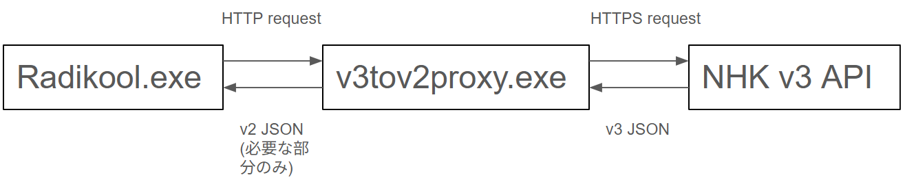
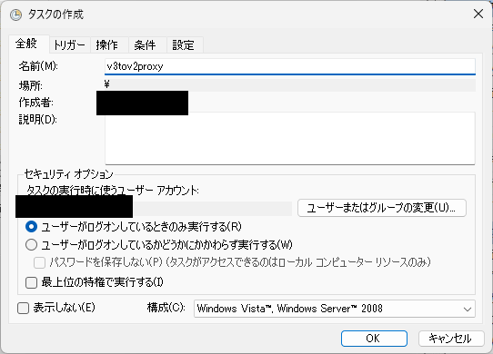
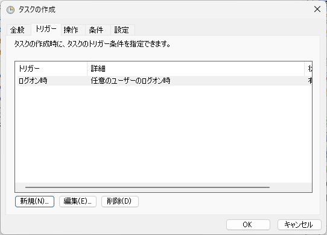
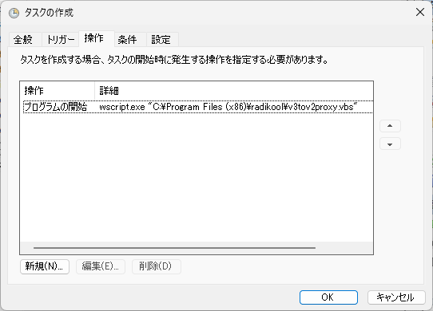
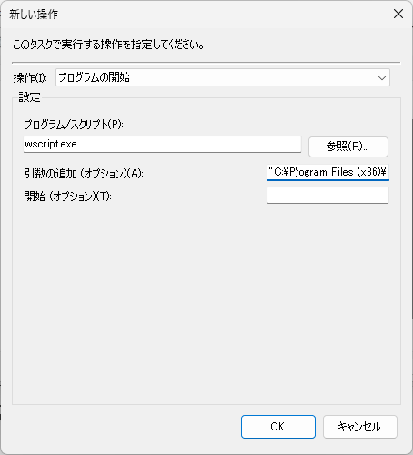

# v3tov2proxy

Radikoolのために、NHKのv3 APIで返されるJSONをV2形式に変換するプロキシアプリ(以下proxy)。

## ダウンロード
最新版の実行ファイル（exe）は、[こちらのリリースページ](https://github.com/hellodevelopersworld/v3tov2proxy/releases/latest)からダウンロードできる。


# 動作

proxyはWebサーバとして動作し、Radikoolのnhk.xmlに書いてあるNHK用の番組表取得URLをこれに向けることで、代わりにV3 APIで番組表を取得し、Radikoolが理解できるようにJSONを変換して返す。


# 使い方

Radikoolを動作させているPCでproxyを起動するか、常時起動しているようなPCがある場合はそれを使う。

## Radikool側の変更

files/nhk.xml内のTimeTableタグに記述してあるURLをproxyのアドレスにする。
```xml:nhk.xml
  <RadioStation>
    <Id>R1_tokyo</Id>
    <Name>ラジオ第1(東京)</Name>
    ～略～
    <TimeTable>http://localhost:8080/papiPgDateRadio?service=r1&amp;area=130&amp;date=[YYYY-MM-DD]&amp;key=_ENTER_YOUR_KEY_</TimeTable>

```

プロトコルはHTTPにする。Radikoolと同じPCでproxyを動作させるなら、ホスト名はlocalhostにする。APIのパスに/v3は不要(proxy内に書いてあるため)。
_ENTER_YOUR_KEY_部分は自分のkeyに置き換えること。なお、&記号はXMLにそのまま書けないので、"\&amp;"と書いてエスケープする必要がある(v2 APIでは&は使われていなかった)。

他のRadioStationについても同じように変更する。service、areaは局、地域に合わせて変更すること。

## proxy側

Python実行環境があれば
'python v3tov2proxy.py'で起動する。またはバイナリも作成してあるので、
v3tov2proxy.exeを起動する。defaultではポート番号8080で待ち受ける。--portオプションで変更することも可能。基本的に常時起動しておく。
初めての実行時にWindowsのファイアウォール、ウイルス対策ソフトで警告されると思うので、動作を許可すること。

### 起動方法Tips

上記方法で単にプログラムを起動すると、コンソールが残ってしまう。例えば、以下のようにすることでコンソールを非表示にできる。

タスクスケジューラにタスクを作って、ログオン時などを起動トリガーにする。
v3tov2proxy.vbsとv3tov2proxy.exeがRadikool.exeと同じパスに置いてあるとする(ex. C:\Program Files (x86)\radikool)。





タスクの操作は以下のように、「プログラム/スクリプト」はwscript.exeにして、「引数の追加」にv3tov2proxy.vbsをフルパスで記述する。v3tov2proxy.vbsの中にv3tov2proxy.exeのフルパスが書いてあるので、例と異なればそれも修正すること。



起動しているかどうかはタスクマネージャーで確認する。


# 開発環境

Anaconda + Python 3.13.11

バイナリの作成方法は
'pyinstaller --onefile v3tov2proxy.py'

